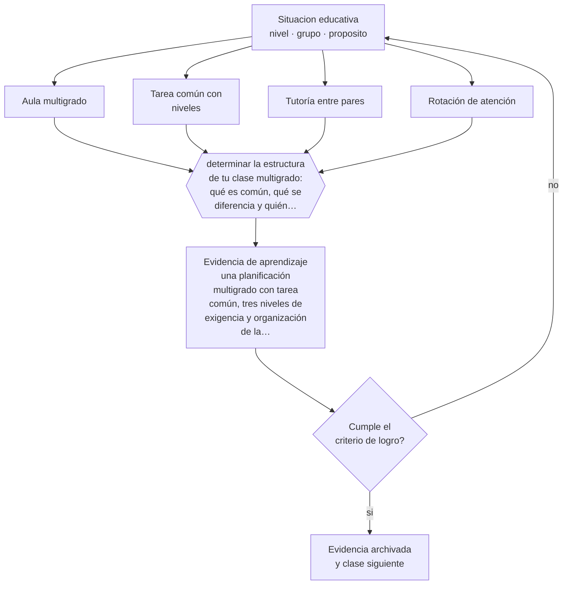

# Clase 273 — Aula multigrado: varios niveles a la vez

> **Parte 22 · Diversidad cultural, lingüística y territorial** — clase 9 de 12

**Estado de evidencia:** `PRACTICA-PROFESIONAL` · **Etapa:** 🟤 Etapa F — Especialización y desafíos contemporáneos · **Población de referencia:** transversal, con foco en contextos interculturales, migrantes y rurales 
**Decisión que habilita:** determinar la estructura de tu clase multigrado: qué es común, qué se diferencia y quién trabaja con quién 
**Evidencia de aprendizaje:** una planificación multigrado con tarea común, tres niveles de exigencia y organización de la autonomía

## 🎯 Propósito

Planificar aula multigrado con tarea común y exigencia diferenciada, aprovechando la heterogeneidad en vez de intentar anularla.

## 📚 Resultados de aprendizaje

Al finalizar esta clase podrás:

1. **Definir** con precisión los cuatro conceptos centrales de la clase y reconocerlos en una situación educativa real, no solo en su enunciado.
2. **Explicar** cómo se planifica para tres niveles a la vez sin preparar tres clases.
3. **Decidir** —la estructura de tu clase multigrado: qué es común, qué se diferencia y quién trabaja con quién— y sostener la decisión con un fundamento escrito.
4. **Producir** la evidencia de la clase —una planificación multigrado con tarea común, tres niveles de exigencia y organización de la autonomía— y contrastarla contra el criterio de logro.
5. **Distinguir** lo que la evidencia sostiene de lo que es práctica instalada, preferencia personal o costumbre de la institución.

## 🧭 Agenda sugerida (90 minutos)

| Minutos | Bloque | Qué ocurre |
|---:|---|---|
| 0–10 | Activación | Recuperar sin mirar la clase anterior y responder la pregunta de foco. |
| 10–25 | Conceptos | Definir los cuatro conceptos y reconocerlos en un caso real. |
| 25–45 | Modelo mental | Recorrer el método: delimitar el contexto y comprobar —no suponer— qué saben ya los estudiantes. |
| 45–70 | Ejemplo trabajado | Aplicar el método al caso de la parte, paso a paso y con evidencia. |
| 70–85 | Taller | Trasladar la decisión al contexto propio y anticipar su alternativa. |
| 85–90 | Cierre | Fijar responsable, plazo e indicador de la evidencia de aprendizaje. |

Fuera de la sesión, la clase exige aproximadamente **una hora y media** de práctica y de
producción de la evidencia. Si el tiempo se recorta, se recorta el ejemplo trabajado, nunca la
producción de evidencia: es la única parte que prueba el aprendizaje.

## 🧩 Conceptos centrales

| Concepto | Comprensión verificable |
|---|---|
| **Aula multigrado** | grupo que reúne estudiantes de dos o más niveles con un solo docente |
| **Tarea común con niveles** | actividad única, con productos y exigencias distintas según nivel, que evita triplicar la preparación |
| **Tutoría entre pares** | enseñanza de un estudiante a otro, con beneficio documentado para ambos cuando está estructurada |
| **Rotación de atención** | organización del tiempo docente para atender a cada grupo mientras los demás trabajan con autonomía |

## 🧠 Modelo mental

El método de esta clase, en cinco pasos que se ejecutan en orden:

1. Delimitar el contexto y comprobar —no suponer— qué saben ya los estudiantes.
2. Clasificar la situación distinguiendo **Aula multigrado** de **Tarea común con niveles**.
3. Decidir con fundamento, usando **Tutoría entre pares** como criterio y declarando la fuente.
4. Anticipar qué evidencia confirmaría la decisión y cuál la refutaría, con **Rotación de atención** a la vista.
5. Registrar lo ocurrido y contrastarlo contra el criterio de logro antes de avanzar.

Lo que hace profesional a este método no son los pasos sino la evidencia que exige en cada uno.
Estas son las señales observables con las que se comprueba, y que deben quedar definidas **antes**
de recogerlas:

| Señal observable | Cómo se recoge y qué significa |
|---|---|
| **Evidencia de partida** | qué sabían o podían hacer los estudiantes antes de la decisión, comprobado y no supuesto |
| **Evidencia de proceso** | qué se observó mientras la decisión se aplicaba, con fecha, contexto y responsable del registro |
| **Evidencia de logro** | qué muestra una planificación multigrado con tarea común, tres niveles de exigencia y organización de la autonomía frente al criterio declarado de antemano |

**Frontera de aplicación.** El método vale mientras las condiciones que lo sostienen se cumplan.
El conocimiento disponible sobre multigrado proviene sobre todo de experiencia sistematizada y de modelos regionales, con investigación experimental escasa. Cuando esa condición falla, el paso siguiente no es forzar el método:
es declarar el límite y decidir con menos certeza, dejándolo por escrito.

## 🗺️ Flujo de razonamiento

## 📖 Desarrollo

### 1. El fondo del asunto

El aula multigrado se percibe como una limitación y tiene una lógica propia que, bien organizada, ofrece posibilidades que el aula homogénea no tiene: tutoría entre pares con edades distintas, progresión visible para el estudiante menor, y responsabilidad real para el mayor. El error de diseño que hace insostenible el multigrado es intentar dictar clases paralelas: tres preparaciones, tres explicaciones y un docente que no alcanza a acompañar a ninguno.

### 2. Frontera conceptual: qué es y qué no es

Los cuatro conceptos de esta clase se confunden entre sí con facilidad, y esa confusión no es
inocua: produce decisiones que atacan el problema equivocado. **Aula multigrado** no es lo
mismo que **Tarea común con niveles** —actividad única, con productos y exigencias distintas según nivel, que evita triplicar la preparación—, y tratarlos como sinónimos hace
que la intervención se dirija al lugar incorrecto. Del mismo modo, **Tutoría entre pares** y
**Rotación de atención** describen aspectos distintos de la misma situación: el primero
enseñanza de un estudiante a otro, con beneficio documentado para ambos cuando está estructurada, mientras el segundo organización del tiempo docente para atender a cada grupo mientras los demás trabajan con autonomía.

La prueba de que la distinción está entendida es operacional, no verbal: dos personas que
observan la misma clase deben poder clasificar el mismo episodio de la misma manera. Si no
coinciden, el problema está en la definición y no en el observador. El error de clasificación más
frecuente en esta materia es el primero de los que se listan más abajo, y conviene anticiparlo
antes de aplicar nada.

### 3. Cómo se observa y se mide

Nada de lo anterior sirve si no se puede observar. Estas son las señales que esta clase usa y
cómo se recogen:

- **Evidencia de partida.** Qué sabían o podían hacer los estudiantes antes de la decisión, comprobado y no supuesto. Se registra con fecha y contexto; sin eso, la señal no distingue una tendencia de una casualidad.
- **Evidencia de proceso.** Qué se observó mientras la decisión se aplicaba, con fecha, contexto y responsable del registro. Se registra con fecha y contexto; sin eso, la señal no distingue una tendencia de una casualidad.
- **Evidencia de logro.** Qué muestra una planificación multigrado con tarea común, tres niveles de exigencia y organización de la autonomía frente al criterio declarado de antemano. Se registra con fecha y contexto; sin eso, la señal no distingue una tendencia de una casualidad.

Ninguna de estas señales es el aprendizaje: son indicios de él. Confundir el indicio con el
fenómeno es el error clásico de la medición educativa, y por eso cada señal se interpreta junto
con el contexto, el punto de partida del grupo y lo que el propio estudiante puede explicar sobre
su trabajo.

### 4. Cómo se traduce en decisiones de enseñanza

La estructura que funciona parte de una tarea o tema común, con productos y niveles de exigencia diferenciados. Se enseñan rutinas de autonomía al inicio del año, se estructura la tutoría entre pares con roles y criterios —no como ayuda espontánea— y se organiza la rotación de atención del docente en bloques declarados. La evaluación se diferencia por nivel sobre el mismo trabajo, lo que reduce la carga de corrección.

### 5. Qué sostiene la evidencia y qué no

El conocimiento disponible sobre multigrado proviene sobre todo de experiencia sistematizada y de modelos regionales, con investigación experimental escasa. La tutoría entre pares tiene respaldo cuando está estructurada, y puede perjudicar al tutor si se abusa de ella. Y el modelo exige del docente un dominio curricular amplio, de varios niveles a la vez, que la formación inicial rara vez entrega.

> **Cómo leer el estado de evidencia `PRACTICA-PROFESIONAL`.** Es conocimiento práctico acumulado del oficio, útil y transferible, pero no probado con diseños de investigación. Trátalo como un buen punto de partida sujeto a comprobación en tu contexto.

### 6. Integración: de los conceptos a una decisión defendible

Una decisión es defendible cuando puede explicarse a alguien que no estuvo presente. Esta clase
te deja en condiciones de la estructura de tu clase multigrado: qué es común, qué se diferencia y quién trabaja con quién, y esa decisión se sostiene solo si
declara cuatro cosas: la evidencia que la funda, el supuesto que asume, el indicador que la
comprobaría y la condición que la haría cambiar.

Ese es también el criterio con el que se evalúa la evidencia de aprendizaje de la clase. Un
análisis que podría copiarse a otra clase, a otro curso o a otro establecimiento sin cambiar una
palabra no es una decisión: es una declaración general, y el oficio empieza justo donde las
declaraciones generales terminan.

## 📚 Lectura comparada

Las obras no cumplen el mismo papel. Esta tabla indica qué lente aporta cada una;
después de leer, escribe una discrepancia real entre al menos dos fuentes.

| Fuente | Lente que aporta | Pregunta crítica |
|---|---|---|
| Colbert, V. *Escuela Nueva: modelo pedagógico para la educación rural* (edición vigente). | el diseño multigrado más documentado de América Latina, con sus materiales y su lógica. | ¿Qué supuesto de esta clase ayuda a poner a prueba? |
| Slavin, R. (2014). *Cooperative Learning and Academic Achievement*. | las condiciones bajo las cuales la tutoría entre pares produce aprendizaje en ambos. | ¿Qué supuesto de esta clase ayuda a poner a prueba? |

La lectura se evalúa por **uso**, no por cantidad de páginas. Tu nota de lectura debe indicar qué
tesis modifica tu diagnóstico, qué evidencia del caso la tensiona y qué decisión concreta
cambiarías después del contraste. Una nota que solo resume el texto no cumple el criterio.

## 🧮 Ejemplo trabajado

**Situación.** El liceo recibió 34 estudiantes migrantes en dos años, 9 de ellos sin dominio del castellano académico, y la Escuela Rural El Maitén atiende a 48 estudiantes en tres cursos combinados con presencia de familias mapuche. Ninguna planificación distingue esas realidades.

**Paso 1 — Delimitar el contexto y comprobar —no suponer— qué saben ya los estudiantes.** El equipo escribe primero el supuesto asociado a **Aula multigrado** y se prohíbe tratarlo como hecho. Contrasta ese supuesto con **Evidencia de partida** y anota qué parte del dato todavía no existe. Del paso sale un registro fechado y una frase explícita: «cambiaríamos de decisión si…».

**Paso 2 — Clasificar la situación distinguiendo Aula multigrado de Tarea común con niveles.** El trabajo aquí es separar lo observado de lo interpretado sobre **Tarea común con niveles**. La evidencia que ordena la conversación es **Evidencia de proceso**; si su definición no está escrita, escribirla es parte del paso. Nada avanza mientras el equipo no acuerde qué contaría como refutación.

**Paso 3 — Decidir con fundamento, usando Tutoría entre pares como criterio y declarando la fuente.** El riesgo de este paso es cerrar demasiado rápido alrededor de **Tutoría entre pares**. Antes de concluir, se enumeran dos explicaciones alternativas del mismo patrón y se revisa si **Evidencia de logro** logra distinguirlas. Si no lo logra, hace falta otra evidencia y así debe quedar registrado.

**Paso 4 — Anticipar qué evidencia confirmaría la decisión y cuál la refutaría, con Rotación de atención a la vista.** Con **Rotación de atención** ya delimitado, la pregunta pasa a ser de consecuencia: qué cambia para los estudiantes, para el tiempo de clase y para la carga del equipo. **Evidencia de partida** entrega la lectura observable; el juicio profesional sigue siendo humano y debe quedar firmado por quien lo hace.

**Paso 5 — Registrar lo ocurrido y contrastarlo contra el criterio de logro antes de avanzar.** El cierre exige compromiso: responsable, fecha, indicador de logro y condición de detención. **Evidencia de proceso** se convierte en la señal de seguimiento, y se acuerda con qué frecuencia se revisa y quién puede declarar que no funcionó sin costo político.

**Síntesis.** La recomendación termina con responsable, fecha, evidencia de logro y señal de
detención. Omitir cualquiera de esas cuatro piezas convierte el análisis en una opinión que nadie
podrá auditar dentro de tres meses, y que por lo tanto nadie corregirá.

## 🔀 Comparación de caminos y límites

Ante la misma situación caben varios cursos de acción. La decisión profesional no es
elegir el «correcto», sino saber qué privilegia cada uno y qué arriesga.

| Camino | Qué privilegia | Cuándo elegirlo | Riesgo principal |
|---|---|---|---|
| Intervenir sobre **Aula multigrado** | Grupo que reúne estudiantes de dos o más niveles con un solo docente | Cuando **Evidencia de partida** es observable y accionable dentro del plazo de la decisión. | Sobrerreaccionar a una señal parcial. |
| Intervenir sobre **Tarea común con niveles** | Actividad única, con productos y exigencias distintas según nivel, que evita triplicar la preparación | Cuando la primera explicación no distingue mecanismo ni responsable. | Convertir el concepto en etiqueta y no en intervención. |
| Observar antes de decidir | Reducir la incertidumbre antes de comprometer tiempo y credibilidad | Cuando la decisión es reversible y la evidencia disponible no distingue causas. | Observar indefinidamente y no decidir nunca. |
| Derivar o escalar | Poner la decisión donde están la competencia y la responsabilidad | Cuando hay normativa, resguardo de datos, salud o vulneración de derechos en juego. | Delegar hacia arriba lo que sí correspondía decidir en el aula. |

**Frontera de aplicación.** El conocimiento disponible sobre multigrado proviene sobre todo de experiencia sistematizada y de modelos regionales, con investigación experimental escasa. Fuera de esa frontera, la comparación
anterior deja de ser válida y la decisión debe tomarse con evidencia distinta.

## 🪜 El mismo tema según el rol

La misma materia cambia de forma según quién decida. Al subir de nivel aumentan las
personas, el tiempo y las consecuencias que quedan dentro de la decisión.

| Nivel | Responsabilidad sobre aula multigrado: varios niveles a la vez |
|---|---|
| **Docente de aula** | Aplica, observa y registra la evidencia; declara qué no puede resolver desde su rol. |
| **Equipo de apoyo o educación diferencial** | Verifica que la decisión no deje fuera a quien más barreras enfrenta y aporta los apoyos. |
| **Jefatura técnico-pedagógica** | Convierte la decisión en criterio compartido, tiempo protegido y acompañamiento. |
| **Dirección** | Decide si esto cambia condiciones institucionales, recursos o el plan de mejora. |
| **Formación e investigación** | Pregunta si la decisión es generalizable, con qué evidencia y qué haría falta para probarlo. |

Si trabajas en uno de esos niveles, la [guía de carrera de tu rol](../../../rutas/README.md)
indica en qué orden conviene recorrer el programa y qué artefactos acreditan tu competencia.

## 🧪 Taller guiado

Aplica la clase a **uno** de los contextos siguientes y repite después el ejercicio en un
contexto de exigencia distinta. Cambiar de contexto es parte del aprendizaje: lo que funciona
con un grupo no se traslada intacto a otro.

| Contexto | Rasgo que cambia la decisión |
|---|---|
| Escuela urbana con alta matrícula migrante | la acogida lingüística no puede depender de un docente voluntario |
| Escuela con población mapuche o aymara | la lengua y el territorio son contenido, no decoración |
| Escuela rural multigrado | la planificación por tarea común es la única sostenible |
| Liceo técnico-profesional | la pertinencia se juega también en el vínculo con el territorio productivo |
| Establecimiento particular subvencionado | el financiamiento condiciona lo que se puede sostener en el tiempo |
| Educación de adultos | la trayectoria interrumpida es la norma y no la excepción |

**Secuencia de trabajo:**

1. Delimita el contexto: nivel, edad, tamaño del grupo, asignatura o experiencia y tiempo real disponible.
2. Declara qué saben ya los estudiantes y **cómo lo comprobaste**, no cómo lo supones.
3. Formula la decisión pedagógica que esta clase habilita y escribe su fundamento.
4. Anticipa qué observarías si la decisión funciona y qué observarías si no funciona.
5. Diseña de antemano la alternativa que aplicarás si la primera estrategia falla.
6. Ejecuta o simula, y registra lo observado con fecha, contexto y evidencia concreta.
7. Produce la evidencia de aprendizaje de la clase.
8. Contrástala contra el criterio de logro, corrige y recién entonces avanza.

## 🏫 Caso profesional

**Situación.** El liceo recibió 34 estudiantes migrantes en dos años, 9 de ellos sin dominio del castellano académico, y la Escuela Rural El Maitén atiende a 48 estudiantes en tres cursos combinados con presencia de familias mapuche. Ninguna planificación distingue esas realidades.

Entrega un **informe de decisión** de una página que contenga:

1. **Hechos y fuentes** — qué está documentado y con qué evidencia, separado de lo que se supone.
2. **Hipótesis** — la explicación más probable y una alternativa que también encajaría.
3. **Dos opciones defendibles** — no una recomendación y un espantapájaros.
4. **Efecto esperado** — sobre los estudiantes, el tiempo de clase, el equipo y los apoyos.
5. **Recomendación** — con su fundamento y la fuente que la respalda.
6. **Condición de revisión** — qué resultado te haría cambiar de decisión.
7. **Responsable y fecha** — quién ejecuta y cuándo se revisa.

Usa al menos **dos** fuentes de la lectura comparada para desafiar tu primera respuesta. Una
recomendación que ninguna fuente pone en duda casi siempre está poco examinada.

## 📥 Evidencia de aprendizaje

Una planificación multigrado con tarea común, tres niveles de exigencia y organización de la autonomía.

Guárdala en `evidence/P22-C273-aula-multigrado-varios-niveles-a-la-vez/` con estos archivos:

| Archivo | Qué contiene |
|---|---|
| `decision.md` | contexto, decisión, fundamento, fuentes con fecha, indicador de logro y riesgos |
| `senales.md` | definición operacional de las tres señales, cómo se recogieron y qué no distinguen |
| `nota-de-lectura.md` | dos fuentes contrastadas, con edición y páginas consultadas |
| `revision-critica.md` | la objeción más fuerte a tu decisión y qué evidencia la invalidaría |

Esta evidencia alimenta el artefacto de la parte: **plan de pertinencia cultural y territorial con acogida lingüística, adecuación multigrado y uso declarado de los recursos SEP**.

## 🏆 Reto verificable

Planifica una semana multigrado con tarea común y tres niveles. Registra cuánto tiempo efectivo dedicaste a cada grupo y ajusta la rotación.

## ✅ Evaluación de la clase

| Criterio | Peso | Evidencia esperada |
|---|---:|---|
| Precisión conceptual | 25 % | Distinciones correctas y observables entre los cuatro conceptos, aplicadas a un caso real. |
| Diagnóstico y evidencia | 30 % | Conocimiento previo comprobado, evidencia recogida con fecha y contexto, y límites del dato declarados. |
| Decisión y alternativas | 30 % | Decisión fundada, alternativa prevista si falla, y condición explícita que la haría cambiar. |
| Responsabilidad y comunicación | 15 % | Diversidad y resguardos considerados, fuentes citadas y evidencia archivada de forma reproducible. |

**Aprobación:** 80 de 100 y ningún criterio bajo el 60 %. Una respuesta que podría copiarse sin
cambios a otra clase, a otro curso o a otro establecimiento se considera insuficiente, aunque
esté bien escrita.

**Criterio de logro de la evidencia:**

- [ ] la planificación declara la tarea común y los tres niveles de exigencia;
- [ ] la tutoría entre pares tiene roles, criterios y límite de tiempo declarados;
- [ ] cada afirmación sobre «lo que funciona» está atribuida a una fuente identificable, con autor y fecha;
- [ ] la decisión es ejecutable con el tiempo, el espacio, el número de estudiantes y los recursos que realmente tienes;
- [ ] la evidencia queda archivada de forma reproducible: otra persona podría revisarla sin que tú se la expliques.

## ⚠️ Errores frecuentes

**Propios de esta clase:**

- Preparar tres clases paralelas y abandonar el esquema por agotamiento en pocas semanas.
- Usar al estudiante mayor como ayudante permanente y restarle su propio tiempo de aprendizaje.

**Característicos de la parte 22:**

- Reducir la interculturalidad a efemérides, comida y vestimenta sin tocar el currículum.
- Interpretar el silencio de un estudiante migrante como falta de capacidad y no como barrera lingüística.

Los cuatro comparten estructura: un síntoma visible, una causa que no se ve y una corrección que
casi siempre es de diseño y no de esfuerzo. Antes de atribuir el problema a los estudiantes o a
ti, comprueba cuál de ellos está operando y qué evidencia lo distinguiría de los otros tres.

## ♿ Diversidad, accesibilidad y ética

El multigrado bien organizado es una respuesta natural a la heterogeneidad y puede beneficiar a estudiantes con ritmos distintos. Mal organizado, el estudiante con más dificultades queda sin atención mientras el docente rota.

Antes de aplicar cualquier decisión de esta clase con estudiantes reales, revisa el
[protocolo de práctica responsable](../../../docs/ETICA_Y_PRACTICA_RESPONSABLE.md):
consentimiento, resguardo de datos personales, proporcionalidad de la intervención y derecho
de cada estudiante a no ser objeto de un ensayo que no le reporta beneficio.

## 🇨🇱 Contexto chileno y cumplimiento

Riesgo característico de esta parte: **Reducir la interculturalidad a efemérides, comida y vestimenta sin tocar el currículum.** Antes de aplicar
cualquier decisión de esta clase en un establecimiento real, verifica el marco vigente:

- Marco institucional y normativo: [`docs/MARCO_CHILE.md`](../../../docs/MARCO_CHILE.md).
- Inclusión y apoyos: [`docs/INCLUSION_Y_DUA.md`](../../../docs/INCLUSION_Y_DUA.md).
- Datos personales, IA y resguardos: [`docs/IA_EN_EDUCACION.md`](../../../docs/IA_EN_EDUCACION.md).
- Fuentes oficiales con cómo leerlas: [`docs/FUENTES.md`](../../../docs/FUENTES.md).

La regla del programa es simple: **la fuente oficial manda sobre el material pedagógico**. Si la
norma cambió después de la fecha de esta clase, gana la norma.

## ❓ Preguntas de comprobación

1. ¿Cuál es la tarea común de tu próxima clase y cómo se diferencia por nivel?
2. ¿Qué rutinas de autonomía enseñaste y cuáles supusiste?
3. ¿Cuánto tiempo propio de aprendizaje pierde el estudiante que hace de tutor?

## 📗 Fuentes y verificación

- Colbert, V. *Escuela Nueva: modelo pedagógico para la educación rural* (edición vigente). **Uso en esta clase:** el diseño multigrado más documentado de América Latina, con sus materiales y su lógica. Lectura selectiva: índice y capítulos pertinentes; registra edición y páginas consultadas. **Localizar:** [ficha](../../../docs/REGISTRO_DE_FUENTES.md#colbert-escuela-nueva-modelo-pedagogico-para-la) — sin localizador verificado todavía.
- Slavin, R. (2014). *Cooperative Learning and Academic Achievement*. **Uso en esta clase:** las condiciones bajo las cuales la tutoría entre pares produce aprendizaje en ambos. Lectura selectiva: índice y capítulos pertinentes; registra edición y páginas consultadas. **Localizar:** [DOI 10.6018/analesps.30.3.201201](https://doi.org/10.6018/analesps.30.3.201201) · [ficha](../../../docs/REGISTRO_DE_FUENTES.md#slavin-2014-cooperative-learning-and-academic-achievement)

Catálogo completo: [registro de fuentes con localizador](../../../docs/REGISTRO_DE_FUENTES.md) ·
[bibliografía del programa](../../../docs/BIBLIOGRAFIA.md) ·
[glosario](../../../docs/GLOSARIO.md) ·
[fuentes oficiales y cómo leerlas](../../../docs/FUENTES.md).

> **Regla de fuentes.** Las obras anteriores estructuran las perspectivas de esta materia.
> Cualquier norma, decreto, orientación ministerial o política institucional mencionada debe
> comprobarse en su fuente primaria vigente antes de usarse con estudiantes reales. El desarrollo
> de esta clase es original y no reproduce capítulos protegidos por derechos de autor.

## 🔗 Conexión con el resto del programa

Continúa la clase 272 y se articula con la 262 y con la 234. Enlaza con la parte 10.

> [!IMPORTANT]
> Material de formación profesional. No reemplaza un título de pedagogía, una habilitación
> legal para ejercer, ni el juicio de un equipo educativo que conoce a sus estudiantes.

---

| Anterior | Índice | Siguiente |
|---|---|---|
| [← 272 · Educación rural: territorio y pertinencia](../class-08-educacion-rural-territorio-y-pertinencia/README.md) | [Parte 22](../README.md) · [Programa](../../../README.md) | [274 · Segregación escolar y efecto par →](../class-10-segregacion-escolar-y-efecto-par/README.md) |
