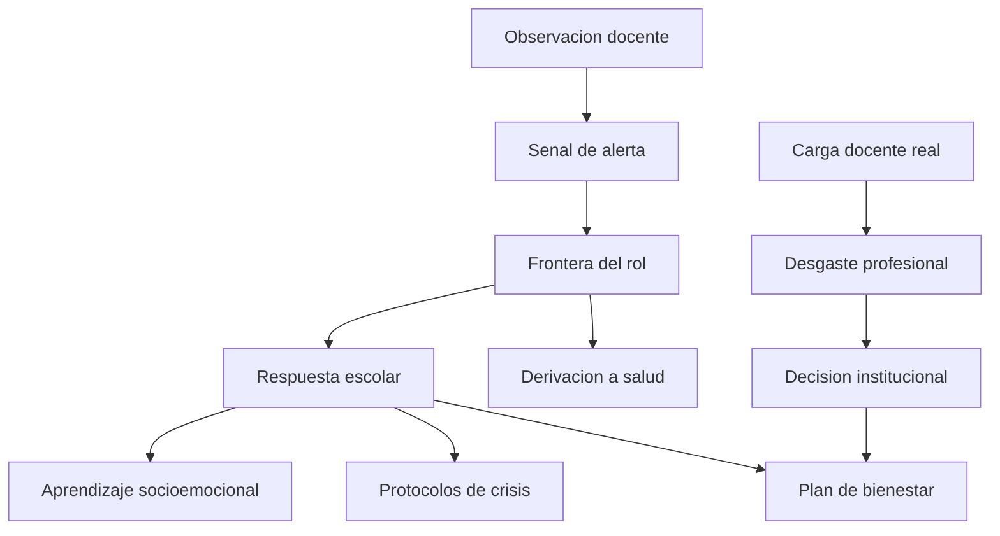

# Parte 23 — Bienestar, salud mental y sostenibilidad del oficio

> *Una escuela no puede sostener el bienestar de sus estudiantes si destruye el de quienes enseñan*

🟤 **Etapa F — Especialización y desafíos contemporáneos** · salida de la etapa: resolver los problemas que efectivamente aparecen en el aula chilena de hoy

**Clases:** 12 (277–288) · **Población de referencia:** transversal, estudiantes y equipos docentes · **Conceptos operacionales:** 48 · **Señales observables:** 36 
**Contenido central:** Alcance de la escuela en salud mental, ansiedad, depresión y riesgo suicida, aprendizaje socioemocional, trauma y adversidad, duelo y crisis, afectividad y educación sexual integral, convivencia digital, carga docente, desgaste profesional y cuidado del equipo

## 🎯 De qué trata esta parte

La salud mental entró a la escuela sin que la escuela decidiera cómo recibirla. El resultado es un docente que atiende situaciones para las que no fue formado, sin protocolo claro, y una institución que responde caso a caso. Esta parte pone límites explícitos: qué le corresponde a la escuela, qué exige derivación, y qué ocurre cuando esa frontera se borra en ambas direcciones.

El recorrido cubre lo que efectivamente aparece: ansiedad y estrés académico, cuadros depresivos, autolesión y riesgo suicida con su protocolo, historias de adversidad y trauma, duelos y crisis comunitarias. Se incluye la afectividad y la educación sexual integral, que es contenido obligatorio y una de las áreas donde los docentes reportan menos preparación y más miedo a equivocarse.

La segunda mitad se ocupa de quienes enseñan. La carga docente, el desgaste profesional y la rotación no son temas de recursos humanos: determinan la calidad de lo que ocurre en la sala. Un plan de bienestar que solo mira a los estudiantes es, en la práctica, un plan incompleto.

## 🏫 Caso de la parte

Las doce clases trabajan sobre la misma realidad, para que puedas ver cómo cambia tu diagnóstico
a medida que avanzas:

> Cuatro docentes con licencia por salud mental en un año, dos derivaciones por autolesión sin protocolo escrito y un consejo de profesores donde nadie quiere asumir jefatura de curso. No existe registro de carga real por docente.

**Artefacto que produces al terminar:** plan de bienestar escolar con protocolo de riesgo, medición de carga docente y compromisos institucionales verificables.

## 📚 Resultados de la parte

Al terminar esta parte podrás:

1. **Distinguir malestar esperable, señal de alerta y situación que exige derivación inmediata**.
2. **Activar un protocolo de riesgo suicida sin improvisar y sin exceder el rol docente**.
3. **Implementar aprendizaje socioemocional con expectativas proporcionales a la evidencia**.
4. **Abordar afectividad y educación sexual con marco normativo y acuerdo con las familias**.
5. **Medir carga docente real y proponer decisiones institucionales que la hagan sostenible**.

## 🗺️ Mapa de la parte

## 🧠 Marco de referencia

- alcance y límite del rol docente frente a la salud mental
- protocolos de riesgo suicida y postvención en comunidades educativas
- aprendizaje socioemocional: efectos comprobados y efectos exagerados
- carga laboral docente, desgaste profesional y responsabilidad institucional

**Autoras y autores que conviene conocer:** Roger Weissberg y el consorcio CASEL, Bruce Perry y equipos de práctica sensible al trauma, Christina Maslach, Michael Marmot en determinantes sociales, UNESCO en educación sexual integral y Superintendencia de Educación

## 📋 Las 12 clases

| # | Clase | Decisión que habilita | Evidencia |
|---:|---|---|---|
| 277 | [Salud mental escolar: alcance y límites de la escuela](class-01-salud-mental-escolar-alcance-y-limites-de-la-escuela/README.md) | determinar qué le corresponde a tu establecimiento en esta situación y qué exige otra competencia profesional | `MARCO-NORMATIVO` |
| 278 | [Ansiedad y estrés académico](class-02-ansiedad-y-estres-academico/README.md) | determinar qué condiciones de tu evaluación o de tu clase están amplificando la ansiedad de tus estudiantes | `CONSISTENTE` |
| 279 | [Depresión, autolesión y riesgo suicida](class-03-depresion-autolesion-y-riesgo-suicida/README.md) | determinar qué activa tu establecimiento ante una señal de riesgo y quién hace cada cosa | `MARCO-NORMATIVO` |
| 280 | [Aprendizaje socioemocional: qué funciona](class-04-aprendizaje-socioemocional-que-funciona/README.md) | determinar qué esperas de tu programa socioemocional y si esa expectativa está respaldada | `CONSISTENTE` |
| 281 | [Adversidad, trauma y prácticas sensibles](class-05-adversidad-trauma-y-practicas-sensibles/README.md) | determinar qué condiciones de previsibilidad y seguridad requiere este estudiante para poder aprender | `EMERGENTE` |
| 282 | [Duelo, crisis y emergencias en la comunidad](class-06-duelo-crisis-y-emergencias-en-la-comunidad/README.md) | determinar qué hace tu establecimiento en las primeras cuarenta y ocho horas de una crisis | `MARCO-NORMATIVO` |
| 283 | [Afectividad y educación sexual integral](class-07-afectividad-y-educacion-sexual-integral/README.md) | determinar qué contenidos de afectividad y sexualidad corresponden a tu nivel y cómo se acuerdan con las familias | `MARCO-NORMATIVO` |
| 284 | [Convivencia digital, imagen y exposición](class-08-convivencia-digital-imagen-y-exposicion/README.md) | determinar qué contenidos de convivencia digital enseña tu establecimiento y en qué momento del año | `EMERGENTE` |
| 285 | [Carga docente, tiempo y sostenibilidad](class-09-carga-docente-tiempo-y-sostenibilidad/README.md) | determinar cuánto tiempo real exige el trabajo docente en tu establecimiento y qué tarea se elimina | `CONSISTENTE` |
| 286 | [Desgaste profesional y su prevención institucional](class-10-desgaste-profesional-y-su-prevencion-institucional/README.md) | determinar qué condición organizacional de tu establecimiento está produciendo desgaste y qué se modifica | `CONSISTENTE` |
| 287 | [Cuidado del equipo y liderazgo del bienestar](class-11-cuidado-del-equipo-y-liderazgo-del-bienestar/README.md) | determinar qué hace tu establecimiento por el bienestar del equipo y qué es solo actividad de camaradería | `PRACTICA-PROFESIONAL` |
| 288 | [Proyecto integrador: plan de bienestar escolar](class-12-proyecto-integrador/README.md) | determinar el plan de bienestar del establecimiento y qué compromisos institucionales lo sostienen | `PRACTICA-PROFESIONAL` |

## ⚠️ Riesgos característicos

- Diagnosticar desde el aula y etiquetar a un estudiante sin competencia profesional para hacerlo.
- Guardar una señal de riesgo por miedo a equivocarse o por sobrecarga del equipo.
- Vender el aprendizaje socioemocional como solución de resultados académicos que no promete.
- Tratar el desgaste docente como problema individual de autocuidado y no como decisión de organización del trabajo.

## 📕 Lecturas de referencia de la parte

- **Durlak, J. et al. (2011). *The Impact of Enhancing Students' Social and Emotional Learning*.** — el metaanálisis que fija qué se puede esperar del aprendizaje socioemocional y qué no.
- **Maslach, C. & Leiter, M. (2016). *Understanding the Burnout Experience*.** — sitúa el desgaste en las condiciones del trabajo y no en la fragilidad de quien lo sufre.
- **UNESCO (2018). *Orientaciones técnicas internacionales sobre educación en sexualidad*.** — el marco que permite abordar afectividad con criterio profesional y no con improvisación.
- **Perry, B. & Szalavitz, M. (2006). *The Boy Who Was Raised as a Dog*.** — explica el efecto de la adversidad temprana sobre la conducta escolar sin convertirlo en excusa.

## ✅ Evidencia mínima para dar la parte por cerrada

- [ ] el mapa de señales de alerta del curso, con su umbral de acción declarado;
- [ ] el protocolo de riesgo escrito, con actores, plazos y registro;
- [ ] la medición de carga real de un equipo docente durante un mes;
- [ ] el plan de bienestar escolar con compromisos institucionales verificables.

## 🧭 Práctica y evaluación de la parte

- [Rúbrica maestra e instrumentos de autoevaluación](../../assessments/README.md)
- [Casos profesionales para resolver con este marco](../../cases/README.md)
- [Laboratorios de decisión](../../labs/README.md)
- [Dónde se archiva la evidencia](../../evidence/README.md)

---

| Anterior | Índice | Siguiente |
|---|---|---|
| [← Parte 22 · Diversidad cultural, lingüística y territorial](../part-22-diversidad-cultural-linguistica-y-territorial/README.md) | [Programa](../../README.md) · [Currículo](../../CURRICULUM.md) | [Parte 24 · Modelos educativos internacionales y evidencia comparada →](../part-24-modelos-educativos-internacionales-y-evidencia-comparada/README.md) |
