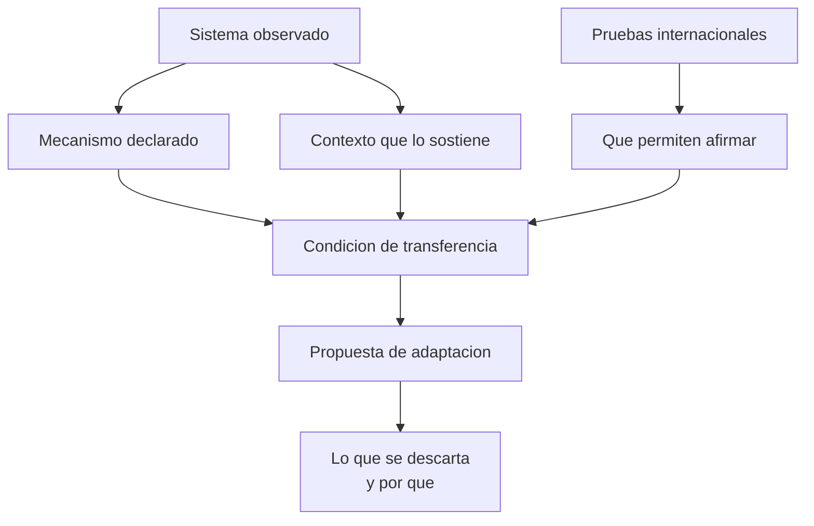

# Parte 24 — Modelos educativos internacionales y evidencia comparada

> *Ningún sistema se exporta entero: se estudia para entender el mecanismo, no para copiar la fachada*

🟤 **Etapa F — Especialización y desafíos contemporáneos** · salida de la etapa: resolver los problemas que efectivamente aparecen en el aula chilena de hoy

**Clases:** 12 (289–300) · **Población de referencia:** directivos, formadores, investigadores y docentes con mirada de sistema · **Conceptos operacionales:** 48 · **Señales observables:** 36 
**Contenido central:** Lectura crítica de sistemas educativos, pruebas internacionales, Finlandia, Singapur, Estonia, Japón, Shanghái, Ontario, Portugal, Polonia, Escuela Nueva de Colombia y Chile en perspectiva comparada

## 🎯 De qué trata esta parte

Cada cierto tiempo un sistema educativo se vuelve modelo y su nombre empieza a usarse como argumento. Finlandia primero, Singapur y Estonia después. El problema no es mirar afuera: es mirar la fachada. Se importa lo visible —la ausencia de pruebas, la jornada corta, la tecnología— y se deja fuera lo que sostiene el resultado, que suele ser la selección y formación docente, la estabilidad de la política y las condiciones sociales del país.

Esta parte enseña a leer un sistema como se lee un estudio: qué se afirma, con qué evidencia, en qué contexto y qué condición haría que el resultado no se repita. Se trabajan casos concretos y también sus contraejemplos, porque los sistemas que mejoraron y los que retrocedieron enseñan cosas distintas y ambas hacen falta.

El cierre es local: qué de lo que Chile hace es propio, qué fue importado, qué se importó bien y qué se importó a medias. La evidencia comparada sirve cuando permite decidir sobre el sistema propio, no cuando produce admiración.

## 🏫 Caso de la parte

Las doce clases trabajan sobre la misma realidad, para que puedas ver cómo cambia tu diagnóstico
a medida que avanzas:

> El sostenedor propone replicar «el modelo finlandés» eliminando pruebas estandarizadas internas. El equipo no distingue qué parte de ese sistema es política, qué parte es formación docente y qué parte no existe en el contexto chileno.

**Artefacto que produces al terminar:** propuesta de adaptación fundamentada que declara qué se toma, qué se descarta y qué condición local haría fracasar el traslado.

## 📚 Resultados de la parte

Al terminar esta parte podrás:

1. **Leer un sistema educativo distinguiendo mecanismo, contexto y condición de transferencia**.
2. **Interpretar resultados de PISA, TIMSS y PIRLS sin exceder lo que esas pruebas permiten afirmar**.
3. **Reconstruir la trayectoria de una reforma y separar lo que la explica de lo que la acompañó**.
4. **Evaluar la viabilidad local de una práctica extranjera con criterios explícitos**.
5. **Redactar una propuesta de adaptación que declare lo que se descarta y por qué**.

## 🗺️ Mapa de la parte

## 🧠 Marco de referencia

- educación comparada: equivalencia funcional antes que semejanza aparente
- qué mide y qué no mide una prueba internacional de rendimiento
- mejora sistémica sostenida frente a reforma anunciada
- transferencia de política educativa y condiciones locales de fracaso

**Autoras y autores que conviene conocer:** Andreas Schleicher y los equipos OCDE, Pasi Sahlberg, Michael Fullan, Yong Zhao, Lucy Crehan, Catherine Lewis en lesson study y los equipos de Escuela Nueva en Colombia

## 📋 Las 12 clases

| # | Clase | Decisión que habilita | Evidencia |
|---:|---|---|---|
| 289 | [Cómo se lee un sistema educativo sin copiarlo](class-01-como-se-lee-un-sistema-educativo-sin-copiarlo/README.md) | determinar qué mecanismo explica el resultado del sistema que te interesa y qué condición lo sostiene | `CONSISTENTE` |
| 290 | [Pruebas internacionales: qué miden y qué no](class-02-pruebas-internacionales-que-miden-y-que-no/README.md) | determinar qué afirmación sobre tu sistema está respaldada por el resultado y cuál lo excede | `ROBUSTA` |
| 291 | [Finlandia: qué se malinterpretó](class-03-finlandia-que-se-malinterpreto/README.md) | determinar qué elemento del caso finlandés es transferible a tu contexto y bajo qué condición | `CONSISTENTE` |
| 292 | [Singapur: currículum, formación docente y matemática](class-04-singapur-curriculum-formacion-docente-y-matematica/README.md) | determinar qué elemento de la cadena singapurense podría adoptarse sin los demás y con qué riesgo | `CONSISTENTE` |
| 293 | [Estonia: equidad y digitalización](class-05-estonia-equidad-y-digitalizacion/README.md) | determinar qué del caso estonio se explica por su política educativa y qué por su contexto | `EMERGENTE` |
| 294 | [Japón y el lesson study](class-06-japon-y-el-lesson-study/README.md) | determinar si tu establecimiento puede sostener un ciclo de lesson study y con qué condiciones | `CONSISTENTE` |
| 295 | [Shanghái: práctica deliberada entre docentes](class-07-shanghai-practica-deliberada-entre-docentes/README.md) | determinar qué estructura de trabajo entre pares es sostenible en tu establecimiento | `EMERGENTE` |
| 296 | [Ontario: mejora sistémica sostenida](class-08-ontario-mejora-sistemica-sostenida/README.md) | determinar qué condición de sostenibilidad falta en las iniciativas de mejora de tu contexto | `CONSISTENTE` |
| 297 | [Portugal y Polonia: reformas que movieron resultados](class-09-portugal-y-polonia-reformas-que-movieron-resultados/README.md) | determinar qué de estas dos trayectorias es común y podría ser el mecanismo relevante | `CONSISTENTE` |
| 298 | [Escuela Nueva de Colombia y modelos de bajo costo](class-10-escuela-nueva-de-colombia-y-modelos-de-bajo-costo/README.md) | determinar qué elemento de estos modelos resuelve un problema real de tu contexto | `CONSISTENTE` |
| 299 | [Chile en perspectiva comparada](class-11-chile-en-perspectiva-comparada/README.md) | determinar qué rasgo del sistema chileno explica el problema que te preocupa y de dónde proviene | `CONSISTENTE` |
| 300 | [Proyecto integrador: propuesta de adaptación fundamentada](class-12-proyecto-integrador/README.md) | determinar qué propones adoptar, con qué condiciones y qué descartas explícitamente | `PRACTICA-PROFESIONAL` |

## ⚠️ Riesgos característicos

- Citar un país como argumento sin haber leído qué hizo realmente y en qué orden.
- Confundir correlación de un ranking con causa de un resultado.
- Importar la práctica visible y omitir la condición institucional que la sostiene.
- Descartar la evidencia comparada por completo y decidir solo por intuición local.

## 📕 Lecturas de referencia de la parte

- **Sahlberg, P. (2011). *Finnish Lessons*.** — la fuente que originó buena parte del mito; leerla completa muestra lo que el mito omitió. **Localizar:** [ISBN 9781470826154](https://openlibrary.org/isbn/9781470826154) · [ficha](../../docs/REGISTRO_DE_FUENTES.md#sahlberg-2011-finnish-lessons)
- **Crehan, L. (2016). *Cleverlands*.** — recorre los sistemas de mejor resultado buscando el mecanismo y no la anécdota. **Localizar:** [ISBN 9781783524914](https://openlibrary.org/isbn/9781783524914) · [ficha](../../docs/REGISTRO_DE_FUENTES.md#crehan-2016-cleverlands)
- **Lewis, C. (2002). *Lesson Study: A Handbook of Teacher-Led Instructional Change*.** — la práctica japonesa descrita con suficiente detalle para juzgar si es transferible. **Localizar:** [ficha](../../docs/REGISTRO_DE_FUENTES.md#lewis-2002-lesson-study-a-handbook-of-teacher) — sin localizador verificado todavía.
- **Zhao, Y. (2014). *Who's Afraid of the Big Bad Dragon?*** — el costo de los sistemas de alto rendimiento, que los rankings no muestran. **Localizar:** [ISBN 9781501200977](https://openlibrary.org/isbn/9781501200977) · [ficha](../../docs/REGISTRO_DE_FUENTES.md#zhao-2014-who-s-afraid-of-the-big)

## ✅ Evidencia mínima para dar la parte por cerrada

- [ ] la ficha de un sistema educativo con mecanismo, contexto y condición de transferencia;
- [ ] la lectura crítica de un resultado de prueba internacional con sus límites declarados;
- [ ] la comparación de dos reformas con lo que cada una permite concluir;
- [ ] la propuesta de adaptación fundamentada, con lo descartado explicitado.

## 🧭 Práctica y evaluación de la parte

- [Rúbrica maestra e instrumentos de autoevaluación](../../assessments/README.md)
- [Casos profesionales para resolver con este marco](../../cases/README.md)
- [Laboratorios de decisión](../../labs/README.md)
- [Dónde se archiva la evidencia](../../evidence/README.md)

---

| Anterior | Índice | Siguiente |
|---|---|---|
| [← Parte 23 · Bienestar, salud mental y sostenibilidad del oficio](../part-23-bienestar-salud-mental-y-sostenibilidad-del-oficio/README.md) | [Programa](../../README.md) · [Currículo](../../CURRICULUM.md) | [Proyectos integradores →](../../projects/README.md) |
