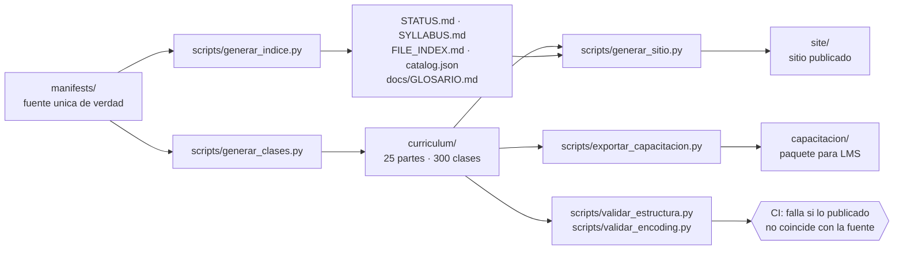

# Arquitectura del repositorio

Cómo está construido este repositorio, por qué el contenido se genera y qué comprueba el CI.

## 1. Principio: una sola fuente de verdad



**Nada de `curriculum/` se edita a mano.** Lo que no está en un manifiesto no existe en el
currículo, y si alguien edita una clase directamente, la validación del CI falla.

## 2. Estructura

```text
manifests/
├── curriculum.json          300 registros: parte, clase, número global, título, slug
├── etapas.json              5 etapas con sus partes y su salida
├── parts/parts-NN-NN.json   18 packs de parte: narrativa, mapa, marco, riesgos, lecturas
├── classes/part-NN.json     300 registros de contenido: conceptos, desarrollo, límites…
└── pedagogia/marco.json     ciclo pedagógico, estados de evidencia, criterios comunes

curriculum/
└── part-NN-slug/
    ├── README.md            página de la parte
    └── class-NN-slug/
        └── README.md        página de la clase

scripts/
├── generar_clases.py        manifiestos → curriculum/
├── generar_indice.py        manifiestos → STATUS, SYLLABUS, FILE_INDEX, GLOSARIO, catalog
├── generar_sitio.py         markdown → site/ (HTML, buscador, tema, diagramas)
├── exportar_capacitacion.py curriculum/ → capacitacion/ (paquete para LMS)
├── validar_estructura.py    conteos, secciones obligatorias, enlaces, manifiestos
└── validar_encoding.py      UTF-8 sin BOM ni mojibake
```

## 3. El contrato de datos de una clase

Cada registro de `manifests/classes/part-NN.json` declara exactamente estos campos, y la
validación falla si falta alguno:

| Campo | Contenido |
|---|---|
| `n` | número global de la clase, de 1 a 300 |
| `evidencia` | uno de los seis estados definidos en `pedagogia/marco.json` |
| `foco` | qué se explica: alimenta el resultado de aprendizaje 2 |
| `proposito` | para qué existe la clase |
| `decision` | la decisión profesional que la clase habilita |
| `entregable` | la evidencia de aprendizaje exigida |
| `conceptos` | exactamente 4 pares de término y definición operacional |
| `desarrollo` · `practica` · `limites` | las tres capas del desarrollo |
| `errores` | 2 errores propios de la clase |
| `criterios` | 2 criterios de logro propios |
| `preguntas` | 3 preguntas de comprobación |
| `lecturas` | 2 o 3 referencias con la razón de esa lectura |
| `inclusion` | qué cambia para quien tiene más barreras |
| `reto` | aplicación que exige salir del material |
| `conexion` | dónde se apoya y dónde se usa después |

De ahí salen las 1.300 a 1.600 palabras de cada clase publicada.

## 4. Qué comprueba el CI

| Comprobación | Script |
|---|---|
| lo publicado coincide con los manifiestos | `generar_clases.py --check` |
| 25 partes, 300 clases, 12 por parte | `validar_estructura.py` |
| las 13 secciones obligatorias de cada clase | `validar_estructura.py` |
| cada clase tiene diagrama y más de 900 palabras | `validar_estructura.py` |
| ningún enlace interno roto | `validar_estructura.py` y `generar_sitio.py` |
| estados de evidencia válidos y campos completos | `validar_estructura.py` |
| UTF-8 sin BOM ni mojibake | `validar_encoding.py` |
| STATUS, SYLLABUS, FILE_INDEX y catálogo al día | `generar_indice.py --check` |
| el sitio compila y el paquete de capacitación también | `generar_sitio.py` y `exportar_capacitacion.py` |
| pruebas estructurales | `tests/` |
| Markdown válido | markdownlint-cli2 |

## 5. Decisiones de diseño y por qué

- **JSON y no YAML** para los manifiestos: sin dependencias, validación estricta y errores de
  sintaxis que se detectan al instante.
- **Sin dependencias externas** en los generadores: solo biblioteca estándar de Python. El
  repositorio se puede reconstruir completo en cualquier máquina con Python 3.11.
- **`site/` y `capacitacion/` no se versionan**: son artefactos. Se reconstruyen en CI y se
  publican desde ahí. Versionarlos produciría diferencias enormes en cada cambio.
- **Un archivo de manifiesto por parte**: mantiene los archivos revisables y los conflictos de
  edición acotados.
- **El glosario se genera desde los conceptos de las clases**: así ninguna definición del glosario
  contradice a la clase que la usa.

## 6. Cómo trabajar sobre este repositorio

```bash
# 1. editar el manifiesto correspondiente en manifests/
# 2. regenerar y validar
python scripts/generar_clases.py
python scripts/generar_indice.py
python scripts/validar_estructura.py --resumen
python scripts/validar_encoding.py
python -m unittest discover -s tests -v

# 3. previsualizar
python scripts/generar_sitio.py && python -m http.server -d site 8000
```

O con los atajos del `Makefile`: `make generar`, `make validar`, `make sitio`, `make todo`.

## 7. Rendimiento

La regeneración completa del currículo toma unos pocos segundos y el sitio menos de un minuto en
una máquina modesta. Es una decisión deliberada: si regenerar fuera lento, se editaría a mano y
el repositorio perdería su única garantía de coherencia.

---

| Anterior | Índice | Siguiente |
|---|---|---|
| [Migración a capacitación](MIGRACION_A_CAPACITACION.md) | [Programa](../README.md) · [Documentos](../FILE_INDEX.md) | [Preguntas frecuentes](PREGUNTAS_FRECUENTES.md) |
